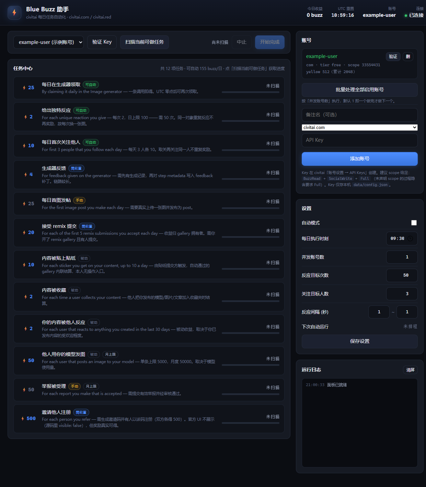

# civitai Blue Buzz 助手

> **Civitai-Bluebuzztool** —— 本机面板 + 零依赖 Node 服务。

一个独立运行的本机工具：填入 civitai API Key，自动完成每日 Blue Buzz 任务。
形态对齐 `workbuddy2api` 的 panel —— 单进程、本机端口、内嵌面板、JSON API。

零依赖：只用 Node 内置模块（`node:http` / 原生 `fetch`）。需要 Node 18+（实测 v24）。



> 面板截图（示例数据）。左栏是 12 项任务清单，右栏是账号、设置与实时日志。
> 点「扫描当前可做任务」后会多出一块扫描结果面板：可做项、判断依据、预计收益，
> 以及**站点侧今日已得**（这是剩余额度的唯一依据，详见第四节）。

```
双击 start.bat      →  服务就绪后自动打开浏览器
或：node server.mjs →  手动访问 http://127.0.0.1:7864/
```

`start.bat` 会在服务**真正就绪的那一刻**（`listen` 回调里）用默认浏览器打开面板，
所以不会出现「浏览器开太早、连接被拒绝」。端口在 bat 里用 `CIVITAI_BUZZ_PORT` 改。

手动 `node server.mjs` 不会弹窗；想让它也自动打开，设 `CIVITAI_BUZZ_OPEN=1`。

---

## 一、它做什么

面板里是 civitai 全部 12 项 Blue Buzz 任务的完整清单，标注每项**能否自动、怎么触发**。
其中 3 项是纯 API 可完成的，工具直接执行（剩余额度以**站点当日流水**为准，见第四节）：

| 任务 | 单次 | 日上限 | 调用 |
|---|---|---|---|
| 每日在生成器领取 | 25 | 25 | `buzz.claimDailyBoostReward` |
| 给出独特反应 | 2 | 100 | `reaction.toggle` |
| 每日首次关注他人 | 10 | 30 | `user.toggleFollow` |

**一轮 = 155 Blue Buzz，已实测确认到账**（逐笔流水见第三之二节）。

> 注：civitai 对 Blue Buzz 有会员倍率（面板上那句 *Earn 4x Blue Buzz with a membership*），
> 非会员的到账就是上表的基础值。倍率会让实际到账更高，但**倍率不改变"该不该执行"的判断** ——
> 剩余额度仍按笔数算。

另外 9 项在清单里如实标注为**被动**或**需前置条件**，不做假承诺：

- **被动**（由他人行为触发，本人无操作入口）：内容被收藏、被贴贴纸、被他人反应、他人用你的模型发图
- **需前置**：生成器反馈（要先有生成记录）、接受 remix 提交（要有人给你的 gallery 投稿）、邀请注册
- **手动**：每日首图发帖（要真上传图）、举报被受理

---

## 二、任务定义的来源（不是猜的）

每一项都取自 civitai 主仓源码 `src/server/rewards/*.reward.ts` 的 `createBuzzEvent()` 定义，
字段逐项对齐：`type` / `awardAmount` / `cap` / `onDemand` / `triggerDescription`。

触发点取自基类注释与各 router：

- `src/server/routers/buzz.router.ts` → `claimDailyBoostReward`（无入参，需 `TokenScope.BuzzRead`）
- `src/server/routers/reaction.router.ts` → `toggle`（`{entityId, entityType, reaction}`，需 `SocialWrite`，限速 60/分钟）
- `src/server/routers/user.router.ts` → `toggleFollow`（`{targetUserId, username?}`，`verifiedProcedure` 无 `requiredScope`）
- `src/server/trpc.ts` → **未声明 `requiredScope` 的过程隐含要求 `TokenScope.Full`**

运行时实测确认（civitai.com）：以上过程在未认证时返回 **401 `UNAUTHORIZED`** 而非 404 —— 端点全部存在。

### 一条容易踩的坑：`Please use the public API instead`

用**无效** API key 调任何 tRPC 过程，civitai 会返回：

```
401 Please use the public API instead: https://developer.civitai.com/
```

这条文案极易被误读成"tRPC 不允许 API key 调用"。它不是那个意思。
源码依据 `src/server/createContext.ts`：

```ts
const isBearerAuth = req.context?.apiKeyId != null;
const acceptableOrigin = !isProd || isBearerAuth || isAllowedOriginRequest(req);
```

携带**有效** API key 的 Bearer 请求，`isBearerAuth` 为真，`acceptableOrigin` **直接置真**，
连来源白名单都不过。只有 key 没通过认证（`apiKeyId` 为 null）时，请求才会掉进来源校验分支，
抛出 `isAcceptableOrigin` 的那条 UNAUTHORIZED —— 于是"key 无效"伪装成了"请改用公开 API"。

所以看到这条提示，先查 key 本身，不要怀疑端点。

---

## 三、API Key 权限（实测结论，不是推测）

### 工具真正调用的端点

**扫描阶段**（点「扫描当前可做任务」发出，全部只读，不产生任何副作用）：

| 端点 | 用途 | 源码要求的 scope |
|---|---|---|
| `GET /api/v1/me` | 验证 key、读账号与自身 scope | 登录态即可 |
| `GET /api/trpc/buzz.getUserAccount` | 读 buzz 账户 | `BuzzRead` |
| `GET /api/trpc/buzz.getUserTransactions` | 读今日奖励流水，算剩余额度 | `BuzzRead` |
| `GET /api/trpc/user.getFollowingUsers` | 读已关注列表，防误取关 | `UserRead` |
| `GET /api/trpc/user.userRewardDetails` | 取官方任务定义（单次额度与上限） | 登录态即可 |
| `GET /api/v1/images` | 取 reaction 的目标池 | 公开，无需认证 |

**执行阶段**（点「开始完成」后）：

| 端点 | 用途 | 源码要求的 scope |
|---|---|---|
| `POST /api/trpc/buzz.claimDailyBoostReward` | 领每日 boost | `BuzzRead` |
| `POST /api/trpc/reaction.toggle` | 给反应 | `SocialWrite` |
| `POST /api/trpc/user.toggleFollow` | 关注他人 | **无声明 → 隐含 `Full`** |
| `GET /api/trpc/user.getCreator` | username 解析成 userId | 公开过程，无 scope |

以上 10 个端点全部经真实 key 实测，返回 200。

### 结论：最小权限集

```
BuzzRead  +  UserRead  +  SocialWrite  +  Full
```

`Full` 绕不开，这是最容易踩的坑：`user.toggleFollow` 是 `verifiedProcedure` 且**没有** `.meta({ requiredScope })`，
而 `src/server/trpc.ts` 的规则写在注释里 ——

> Procedures without `.meta({ requiredScope })` implicitly require `TokenScope.Full`.

少勾这一项，「关注他人」会直接 401，而另外两项照常工作，表现为"大部分能跑、就一项不行"的迷惑现象。

### 怎么选

**最省事**：创建 key 时直接选「完全访问 / Full access」。这种 key 的 `tokenScope` 回显是一个
全 1 的位掩码（`33554431` = `0x1FFFFFF`，25 位全开），三项任务一次跑通，无需再纠结勾选。

**要细粒度**：至少勾上 Buzz 读取、用户资料读取、社交写入，**并且必须包含 Full 那一项**。
少 `BuzzRead` → 扫描就失败（读不到流水，无法算剩余额度）；少 `UserRead` → 关注任务被安全闸跳过；
少 `SocialWrite` → 反应任务 401。

### 三步自检

权限问题会在三个地方依次暴露，不用猜：

1. **验证 Key** —— 回显 `username · tier · tokenScope`，先确认 key 本身有效
2. **扫描** —— 需要 `BuzzRead` + `UserRead`，失败会在面板上直接写明原因
3. **开始完成** —— 需要 `SocialWrite`，逐项报错会告诉你哪一项缺权限

面板的「扫描结果」里还会列出本次扫描**实际调用了哪些端点、什么状态码**，
不用信文档，看它自己招供。

---

## 三之二、实测数据（2026-09-29，civitai.red）

这一轮是真实 key、真实账号、真实执行，不是模拟。

**执行结果**：50 次反应 + 3 个关注 + 1 次每日领取，**全部返回 200**。

**到账核对**（以站点交易流水为准，逐笔可查）：

| 奖励描述（站点原文） | 笔数 | 金额 |
|---|---|---|
| `For encouraging others to post content` | 50 | 100 |
| `For first 3 people that you follow each day` | 3 | 30 |
| `For claiming daily boost rewards` | 1 | 25 |
| **合计** | | **155** |

与任务定义推算的理论值**完全一致**。所有奖励的方向都是 `yellow -> blue`（从 yellow 铸造、入 blue 钱包）。

**这一轮暴露并修掉的一个真问题**：首轮执行时理论 155、实际只到账 83。差额不是 bug，而是
**用户当天已经手动点过 36 次赞**，日上限 100 已被占用，多做的 36 次既拿不到 buzz、
又在别人的内容上留下了真实的点赞痕迹。根因是「用本地计数推断剩余额度」这个设计本身错了 ——
现在改为**先查站点当日流水、以站点侧已得额度为准**，上面那次"可做 0 项"的扫描就是修复后的行为。

**顺带证实的两个 API 事实**（都写进代码注释了）：

- `buzz.getUserAccount` **不返回 blue 账户**，尽管 Blue Buzz 全部入账到 blue 钱包。
  拿它做"收益核对"会永远得到 0 ——必须走 `buzz.getUserTransactions`。
- `buzz.getUserTransactions` 的入参是 `z.date()`，走 superjson transformer，
  必须带 `meta.values` 标注日期类型，否则报 `expected date, received string`。

---

## 三之三、与官方任务中心的交叉验证

拿 civitai 官方后台的任务中心页面与本工具的流水口径逐条对照，**三项自动任务完全吻合**：

| 任务 | civitai 官方后台 | 本工具（流水口径） |
|---|---|---|
| 给出独特反应 | 100 / 100 | 100（50 笔） |
| 每日首次关注他人 | 30 / 30 | 30（3 笔） |
| 每日在生成器领取 | 25 / 25 | 25（1 笔） |
| 生成器反馈 / 首次发图 / 贴纸 / remix | 0 | 0 |

**连 UTC 日界倒计时都对上了**：官方页面显示 `Resets in 14h 24m`，本工具面板同一时刻显示 `14:26:52`，
差约 3 分钟 —— 正是两张截图之间的时间差。两个独立来源在**数值**和**日界**上同时吻合，
说明「按流水求和」这条口径与官方 UI 的数据源是等价的。

### 官方任务定义接口（`user.userRewardDetails`）的对照结果

本工具用这个只读接口取官方的单次额度与上限，**采信官方值而不是吃硬编码常量** ——
官方调额后工具自动跟上（调高时沿用旧值只是保守，调低时沿用旧值会**超发**，而超发有副作用）。

对照 11 项的结果：**单次金额 11/11 一致，上限 11/11 一致，`description` 原文 11/11 逐字一致**
（后者是流水归类的依据）。

两处差异都是官方侧的已知行为，不是本工具的错误：

- **`interval` 字段：11 项里 7 项官方返回空。** 这 7 项全是 `onDemand: true`。
  源码对得上：`interval` 取自 `caps[]` 数组里的 `intervalCap`，而 onDemand 项用的是**单值 `cap`**，
  取不到 `intervalCap` 自然是 `undefined`。语义上它们确实是按 UTC 日结算的 ——
  `dailyBoost.getKey` 用 `dayjs().startOf('day').format('YYYYMMDD')` 当 forId、
  Redis 去重键按 UTC 日过期、官方页面底部那句 `Resets in 14h 24m` 都是证据。
  所以本工具的本地标注（`day`）是对的。
- **官方返回 11 项，本工具列 12 项。** 多出来的是 `userReferred`（邀请注册，500 buzz），
  它在源码里标了 `visible: false` —— 官方 UI 不展示，但奖励真实可得，所以本工具保留并注明。

---

## 三之四、API Key 怎么创建

在 civitai「账号设置 → API Keys」创建。面板添加账号后会自动调 `GET /api/v1/me` 验证，
并在账号卡上回显 `username · tier · tokenScope` —— scope 够不够，在这里就看得见。
Key 只存本机 `data/config.json`，面板与 API 一律只回脱敏串（形如 `abcd...wxyz`），不提供读取明文的接口。

---

## 四、两阶段流程与并发模型

### 扫描 → 确认 → 执行

工具**不会自己开跑**。流程是刻意拆成两段的：

1. **扫描**（点「扫描当前可做任务」）—— **纯只读**。调用的全部是 query 类端点：
   `GET /api/v1/me`、`buzz.getUserAccount`、`user.getFollowingUsers`、公开图片接口 `GET /api/v1/images`。
   不产生任何写操作，不改变账号状态。产出一张「当前可做的任务 + 判断依据 + 计划次数 + 预计收益」。
2. **确认执行**（点「开始完成」）—— 只做扫描里标了 `doable` 的项。没有扫描结果时按「开始完成」会先自动补一次扫描；
   扫描失败（如 key 无效）则**直接拒绝执行**，不会带病启动。

**没扫描之前，面板不显示任务进度**——因为工具的本地记录推不出站点侧真实进度，与其显示一个假的 `0/100`，
不如显示「未扫描」。扫描结果里每条可做项都带依据（如「已关注 32 人，计划新增 3 人」），你能看懂它凭什么这么判断。

### 并发与节奏

| 参数 | 默认 | 说明 |
|---|---|---|
| 并发账号数 | **1** | 同时处理的账号数。**1 = 严格串行**，一个账号做完才做下一个 |
| 反应间隔 | **1s** | 相邻 reaction 之间的间隔 |
| 关注间隔 | 1.5~2.5s | 站点未给 follow 独立限速，取得比 reaction 保守 |
| 账号间隔 | 3s | 相邻账号之间的空档，避免多账号同时刻打点被关联 |

**单个账号内部的操作永远是串行的**，并发数只决定多账号之间的重叠度。

关于 1s：civitai 的 `reactionRateLimits` 第一档就是 **60 次/分钟**，所以 1 秒 1 次正好压在该上限上。
这是你的规格，照做了；引擎在命中 429 时会自动退避 30 秒再续，不会把失败当成功记。
如果哪天想放宽到整数秒以上，改「反应间隔」一栏即可。

### 三道安全闸

1. **扫描与执行分离** —— 没有任何路径能在未经确认的情况下发出写操作。
2. **follow 的安全闸** —— `toggleFollow` 是 toggle 语义，对已关注的人再调一次就是**取关**。
   因此扫描阶段必查已关注列表并排除；**取不到列表就整项标为不可做**，绝不在盲状态下调用。
3. **认证失败立即中止整轮** —— 不做无谓重试；单次失败（非认证类）只记进 warnings，不中断整轮。

### 收益怎么核对

扫描时读一次余额作为基线，执行完再读一次，面板同时给出两个数：

- **理论值** —— 按任务定义推算（如 50 次反应 × 2）
- **实测到账** —— 站点侧余额差值

两者都显示，是因为会员倍率会让实际到账高于基础值；只有实测差值能证明钱真的到了。
读不到余额时两处都留空，不编数字。

密钥只存本机 `data/config.json`（写入时尝试收 600 权限），面板与 API 一律只回脱敏串
（`abcd...wxyz`），不提供读取明文的接口。服务只监听 `127.0.0.1`。

**关于账号风险，如实说**：反应与关注是社交行为，自动化执行属于灰色地带。
civitai 对这些行为有信誉分与限速机制，但没有"每日任务自动化"的黑白条款。
工具默认节奏保守，**是否使用由你决定**；风控后果（如信誉分下调）工具无法替你承担。
被动任务（收藏、贴纸、他人反应）本来就不需要也不应该自动化 —— 那部分只做展示。

---

## 五、目录结构

```
civitai-buzz/
├── start.bat            双击启动
├── server.mjs           HTTP 服务 + JSON API + SSE
├── src/
│   ├── civitai.mjs      civitai tRPC/REST 客户端（端点、错误分类）
│   ├── tasks.mjs        12 项任务权威定义表
│   ├── engine.mjs       执行引擎（三个 runner + 安全闸）
│   ├── store.mjs        账号、设置、当日计数、日志的持久化
│   └── scheduler.mjs    每日定时调度（UTC 日界对齐）
├── public/              面板（index.html / app.js / style.css）
├── docs/
│   ├── API-KEY-权限侦测报告.md    ← 单独成篇，可直接分享
│   └── panel.png                  面板快照
├── scripts/
│   ├── probe-transactions.mjs     拉当日奖励流水并逐笔核对收益
│   └── shot.mjs                   CDP 截图小工具（调试用）
└── data/                运行时数据（config.json / state.json / run.log）
```

> 想直接把权限结论发给别人？发 [`docs/API-KEY-权限侦测报告.md`](docs/API-KEY-权限侦测报告.md) 就够，
> 它是自包含的 —— 结论、源码依据、权限不足的表现、复现方法都在里面。
```

## 六、HTTP API

| 方法 | 路径 | 说明 |
|---|---|---|
| GET | `/api/state` | 全部状态：账号、任务进度、设置、调度 |
| GET | `/api/events` | SSE 实时事件流（进度、日志） |
| GET | `/api/logs?limit=` | 最近日志 |
| POST | `/api/accounts` | 添加账号 `{name, host, apiKey}` |
| PATCH | `/api/accounts/:id` | 改名 / 换 key / 启停 |
| DELETE | `/api/accounts/:id` | 删除账号 |
| POST | `/api/accounts/:id/verify` | 调 `/api/v1/me` 验证并缓存 profile |
| POST | `/api/accounts/:id/scan` | **阶段一**：只读扫描，产出可做任务与依据 |
| POST | `/api/accounts/:id/run` | **阶段二**：按扫描计划执行（无扫描结果会先补扫） |
| POST | `/api/run-all` | 批量：扫描全部启用账号后按 `concurrency` 执行 |
| POST | `/api/accounts/:id/cancel` | 中止 |
| POST | `/api/accounts/:id/reset` | 清本机当日计数（不影响站点额度） || PATCH | `/api/settings` | 自动模式、时刻、反应/关注目标数、延迟区间 |

---

## 七、日界说明

civitai 的每日上限按 **UTC** 结算，面板顶栏的倒计时就是距下一个 UTC 零点的时间。
北京时间比 UTC 早 8 小时 —— UTC 零点 = 北京时间早上 8:00。
